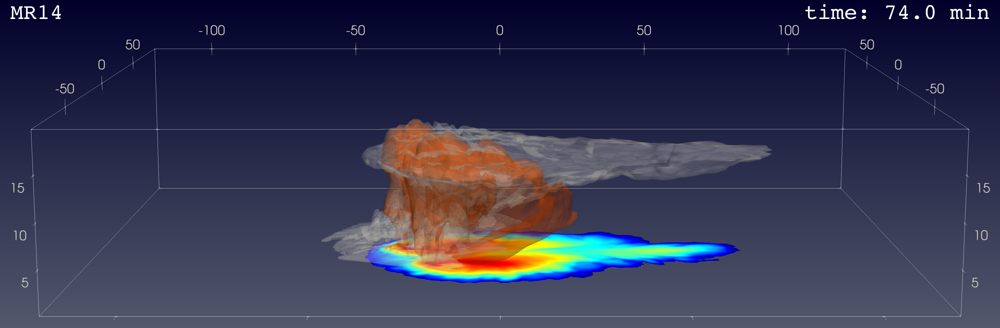

# Der Einfluss von CAPE auf bodennahen Hagel in simulierten Superzellen

Diese Analyse verändert indirekt das CAPE einer Atmosphäre, in welcher Superzellen simuliert werden. Anschließend wird die Vertikalgeschwindigkeit und horizontale Ausprägung der Aufwindzone quantifiziert und die Auswirkungen auf den bodennahen Hagel betrachtet. Nähere Infos sind der schriftlichen [Ausarbeitung](report/main.pdf) zu entnehmen.

Diese Arbeit wurde als Teil der Vorlesung *Angewandte Programmierung für die Wettermodellierung* der FU Berlin angefertigt. 
